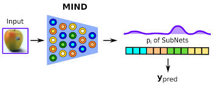

# Fil-Federeted-Learning

We present **FIL** a model for **Federated class Incremental Learning without forgetting** that implements replay free class increamental learning paradigm.

## Why FIL?

Federated Learning is a distributed machine learning paradigm in which multiple nodes (clients) collaboratively train a shared global model without sharing their raw data. Instead of centralizing data from different sources, each client keeps its local data private and performs training independently.

After local training, clients send only model updates such as learned weights or gradients to a central server. The server aggregates these updates to produce a new global model, which captures knowledge from all clients as if it had been trained on the combined dataset. The updated global model is then redistributed to clients for the next training round.

This approach enables collaborative learning while preserving data privacy and reducing the risks associated with centralized data storage. 

When different clients are exposed to different learning tasks or class subsets over time, the training setting is referred to as Federated Class-Incremental Learning (FCIL). In this scenario, each client learns new classes sequentially while having no access to data from previously learned tasks, nor to data belonging to other clients.

At each incremental step, clients train a local model using only the data of their current task. Once local training is completed, the updated model parameters are sent to a central server, where they are aggregated to form a new global model. This global model is then redistributed to the clients and used as the starting point for training on the next novel task. The process repeats as new classes become available over time.

Federated class-incremental learning introduces several challenges beyond standard federated learning. In particular, the model is affected by catastrophic forgetting, as learning new classes may significantly degrade performance on previously learned ones. This issue is further exacerbated by the non-IID distribution of classes across clients, the absence of past data, and the aggregation of heterogeneous updates originating from different tasks and training stages

Our approach leverages knowledge distillation from previous model states to preserve learned representations while acquiring new classes, without requiring access to old data or shared memory buffers. By integrating this strategy into the federated setting, we are able to mitigate catastrophic forgetting and stabilize training across incremental tasks and distributed clients, while maintaining privacy and scalability.

**FIL** is a **Federated Class-Incremental Learning (FCIL)** approach inspired by **MIND**  
[*Distilled Replay-Free Class-Incremental Learning*](https://arxiv.org/pdf/2312.02916).

FIL addresses the challenge of **catastrophic forgetting** in class-incremental settings **without relying on data replay**. The method combines **knowledge distillation** and **parameter isolation** to preserve previously learned knowledge while incrementally learning new classes.

Despite using a **compact and energy-efficient architecture**, FIL achieves performance comparable to significantly larger models. This makes it particularly suitable for **federated learning scenarios**, where communication efficiency, privacy, and limited computational resources are critical constraints. To further enhance model performance, we introduce a **novel, model-agnostic Test-Time Data Augmentation (TTDA) technique**.  
This approach improves robustness and predictive accuracy at inference time without modifying the training procedure or the underlying model architecture.
 

# How to use?
